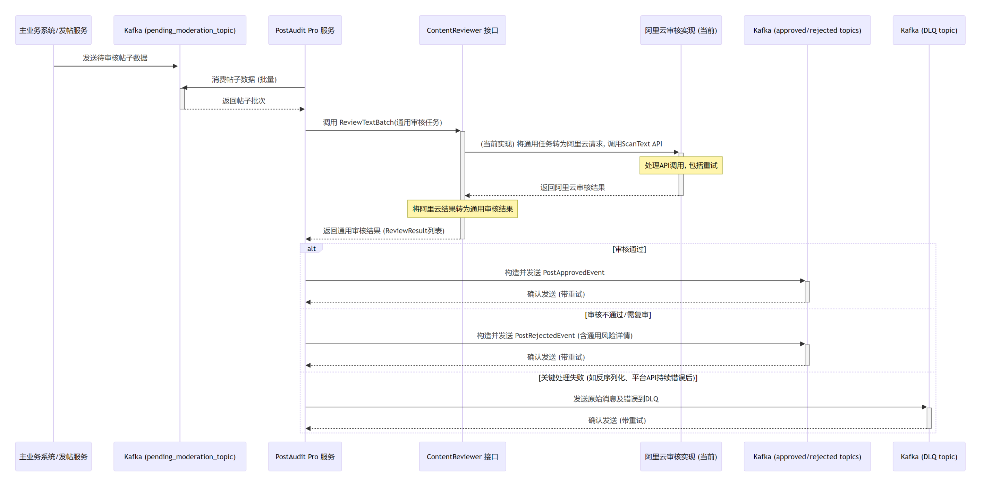

# PostAudit Pro: 通用内容审核微服务

**一个灵活、可扩展、事件驱动的内容审核解决方案，旨在轻松集成多种审核平台，为您的应用保驾护航。**

---

## 🌟 项目概览与愿景

`PostAudit Pro` 是一个致力于提供**通用型、与具体审核平台解耦的内容审核能力的微服务**。它通过精心设计的抽象层，实现了对不同内容审核服务提供商的灵活适配和动态切换。

本项目的核心愿景是构建一个健壮、高效、易于维护和扩展的后端审核中台。它可以作为独立的微服务部署，通过 Kafka 消息队列与您的主业务系统异步协作，自动化处理文本（并为未来扩展至图片、音视频等其他内容类型奠定基础）的审核请求，并将审核结果分发至下游系统。

其核心设计目标是：无论您初期选择哪家云服务商的审核API，或未来希望更换、组合使用多家服务商的能力，`PostAudit Pro` 都能以最小的改动成本平滑适应您的业务发展需求。

---

## 🏗️ 系统架构图

以下是 `PostAudit Pro` 服务的核心架构图：



---

## ✨ 核心特性与技术亮点

本服务在设计和实现上着重考虑了以下方面：

* **🛡️ 可插拔的内容审核平台 (策略模式实现)**
    * **统一接口定义**: 通过定义核心的 `ContentReviewer` 接口 (`internal/auditplatform/interface.go`)，规范了所有审核平台适配器必须遵循的行为契约。
    * **通用数据模型**: 设计了与平台无关的审核任务 (`TaskData`) 和审核结果 (`ReviewResult`, `RejectionDetail`) 数据模型 (`internal/auditplatform/models.go`)，确保了数据在服务内部流转的平台中立性。
    * **解耦实现**: 业务逻辑层 (`internal/kafka/audit_handler.go`) 依赖于抽象接口，而非具体的平台SDK实现。
    * **配置驱动切换**: 支持通过配置文件中的 `audit_platform` 字段 (`internal/config/config.development.yaml`) 动态选择并实例化所需的审核平台客户端 (`main.go`)。
    * **易于扩展**: 添加新的审核平台支持，主要工作集中在实现 `ContentReviewer` 接口，对核心业务逻辑影响极小。当前已实现对阿里云内容安全服务 (`imageaudit` - ScanText API) 的适配。

* **🚀 异步化、事件驱动架构**
    * **Kafka深度集成**: 完全基于 Kafka 消息队列进行任务的异步接收和审核结果的派发，有效削峰填谷，提升系统整体的响应能力和吞吐量。
    * **明确的业务主题**:
        * `pending_moderation_topic`: 用于接收上游系统发送的待审核帖子数据。
        * `approved_posts_topic` & `rejected_posts_topic`: 用于发布审核通过和不通过（含需人工复审）的结构化结果事件。
          (相关主题配置见 `config.development.yaml`)

* **💪 可靠性与弹性设计**
    * **批量处理**: Kafka 消息的消费和对审核平台 API 的调用均采用批量处理模式，显著提升处理效率，降低单位请求开销。
    * **幂等 Kafka 生产者**: 确保审核结果事件在 Kafka Broker 端“精确一次”写入（At-Least-Once + Idempotence），有效防止因重试导致的结果事件重复。
    * **健壮的API调用重试**: 内置针对审核平台 API 调用的指数退避重试机制，能有效应对网络抖动或平台瞬时限流等临时性故障。
    * **结果发送重试**: 向 Kafka 发布审核结果事件时，若发生临时性发送失败，同样会进行重试。
    * **死信队列 (DLQ) 机制**: 对于无法成功反序列化或在业务处理中遭遇不可恢复错误的“毒消息”，会自动路由到专用的死信队列主题 (`post_audit_dlq_topic`)，保障主审核流程的健壮性，同时方便后续对问题消息进行追踪和处理。

* **⚙️ 配置驱动与便捷的环境管理**
    * **外部化配置**: 所有关键运行时参数，包括 Kafka 连接信息、审核平台凭证、API 超时设置、各业务主题名称、日志级别等，均通过外部 YAML 文件 (`internal/config/config.development.yaml`) 进行管理，实现了配置与代码的分离。
    * **多环境支持**: 利用 `viper` 库（通过封装的 `core.LoadConfig`）加载配置，易于为不同环境（开发、测试、生产）提供独立的配置文件。
    * **Dockerized Kafka 环境**: 项目附带 `docker-compose.yaml`，能够一键启动一个包含两个 Broker 的 Kafka KRaft 集群，为本地开发和集成测试提供了极大的便利。

* **🧹 清晰的模块化与代码组织**
    * **遵循 Go 项目布局最佳实践**: 合理使用 `internal` 目录来组织项目内部代码，确保了代码的封装性和可维护性。
    * **高内聚低耦合的模块设计**:
        * `auditplatform`: 定义通用审核接口与核心数据模型，是实现平台无关性的基石。
        * `aliyunclient` (及未来可能的其他平台客户端): 各审核平台的具体适配实现。
        * `kafka`: 封装了所有与 Kafka 交互的逻辑，包括消费者组管理、消息生产者、以及核心的消息批处理与业务编排 (`audit_handler.go`)。
        * `config`: 负责配置的定义、加载与管理。
        * `models`: 定义了服务内部流转的业务事件和数据实体模型。
        * `constants`: 集中管理服务中使用的各类常量。

* **📄 全面的结构化日志系统**
    * **集成 `Zap` 日志库**: 提供高性能的结构化日志记录能力，日志格式默认为 JSON，便于机器解析和日志管理系统收集。
    * **丰富的上下文信息**: 日志中包含了操作路径、关键参数、错误详情等，为问题排查和系统监控提供了有力支持。
    * **可配置性**: 日志级别（debug, info, error 等）和输出目标可通过配置文件灵活调整。

---

## 📖 设计细节：核心组件交互

`PostAudit Pro` 的核心工作流程如下：

1.  **消息消费 (`internal/kafka/consumer_group.go`)**:
    * `KafkaConsumerGroupHandler` 监听 `pending_moderation_topic`，批量消费待审核的帖子数据。

2.  **业务编排与审核 (`internal/kafka/audit_handler.go`)**:
    * `AuditProcessorService` 接收帖子批次，将每条数据转换为通用的 `auditplatform.TaskData`。
    * 通过依赖注入的 `auditplatform.ContentReviewer` 接口实例，调用 `ReviewTextBatch` 将任务提交给选定的审核平台。

3.  **审核平台适配 (`internal/auditplatform/` 和 `internal/aliyunclient/`)**:
    * **`ContentReviewer` 接口** (`interface.go`) 定义了标准方法。
    * **`AliyunAuditClient`** (`audit_service.go`) 作为具体实现，负责与阿里云API交互，并处理数据格式的转换。

4.  **结果处理与事件发布 (`internal/kafka/audit_handler.go`, `internal/kafka/producer.go`)**:
    * `AuditProcessorService` 收到通用的 `ReviewResult` 后，构建相应的 `PostApprovedEvent` 或 `PostRejectedEvent`。
    * 使用 `EventProducer` 将结果事件发布到 Kafka 的对应主题。

5.  **死信处理 (`internal/kafka/producer.go`, `internal/kafka/consumer_group.go`)**:
    * 处理失败的“毒消息”被发送到死信队列主题。

### `internal/auditplatform` 抽象层的关键作用

`auditplatform` 包是实现“通用审核微服务”目标的核心。它通过以下方式实现了高度的灵活性和可扩展性：

* **接口隔离**: `ContentReviewer` 接口将“如何进行审核”的抽象定义与“由谁以及如何具体执行审核”的实现细节分离开。
* **标准化数据契约**: `TaskData`, `ReviewResult`, `RejectionDetail` 作为标准的数据交换格式，使得上层业务逻辑无需关心不同审核平台API请求和响应的异构性。
* **依赖倒置**: `auditProcessorService` 依赖于抽象的 `ContentReviewer` 接口，而不是任何具体的实现。具体的审核平台客户端在运行时通过 `main.go`进行注入。

这种设计使得添加对新审核平台的支持变得简单直接：只需为新平台创建一个新的包，实现 `ContentReviewer` 接口，并在主程序中根据配置选择加载即可。

---

## 🛠️ 技术栈

* **核心语言**: Go
* **消息中间件**: Apache Kafka
* **Kafka Go 客户端**: IBM/sarama
* **内容审核服务 (当前实现)**: 阿里云内容安全 (ImageAudit 服务 - ScanText API)
* **配置管理**: `spf13/viper` (通过项目内封装的 `core.LoadConfig` 使用)
* **日志框架**: `uber-go/zap` (通过项目内封装的 `core.NewZapLogger` 使用)
* **容器化支持**: Docker, Docker Compose (用于快速搭建 Kafka 开发环境)
* **唯一ID生成**: `github.com/google/uuid`

---

## ⚙️ 先决条件

在运行此服务之前，请确保您已准备好以下环境和依赖：

* **Go 语言环境**: 推荐使用 Go 1.18 或更高版本。
* **Docker 及 Docker Compose**: 用于运行和管理 Kafka 服务。
* **内容审核平台账户**:
    * **阿里云**: 需要有效的 AccessKey ID 和 AccessKey Secret，并已开通内容安全（ImageAudit）服务。
    * 或其他您希望集成的审核平台的相应凭证和服务。

---

## 🚀 快速上手指南

### 1. 服务配置

核心配置文件位于 `internal/config/config.development.yaml`。在首次运行时，建议复制此文件为您环境的配置文件（例如 `config.local.yaml` 或 `config.production.yaml`），并修改以下关键部分：

* **选择审核平台**:
    ```yaml
    audit_platform: "aliyun" # 当前支持 "aliyun", 未来可扩展
    ```

* **阿里云审核配置 (`aliyun_audit`)** (如果 `audit_platform` 设置为 "aliyun"):
    ```yaml
    aliyun_audit:
      access_key_id: "YOUR_ALIYUN_ACCESS_KEY_ID"
      access_key_secret: "YOUR_ALIYUN_ACCESS_KEY_SECRET"
      region_id: "cn-shanghai" # 根据您的服务区域调整
      endpoint: "imageaudit.cn-shanghai.aliyuncs.com" # 阿里云内容安全的接入点
      timeout_ms: 5000 # API调用超时时间 (毫秒)
      scenes: # 您希望阿里云审核的场景标签列表
        - "spam"
        - "ad"
        - "porn"
        - "abuse"
    ```

* **Kafka 配置 (`kafka`)**:
    ```yaml
    kafka:
      brokers:
        - "localhost:9092" # 根据您的Kafka集群地址修改
        - "localhost:9093"
      version: "2.8.1"      # 请确保与您的Kafka版本兼容
      consumer_group_id: "post_audit_consumer_group"
      topics:
        pending_moderation: "pending_moderation_topic"
        approved: "approved_posts_topic"
        rejected: "rejected_posts_topic"
        dead_letter_queue: "post_audit_dlq_topic"
      # ... 其他 Kafka 生产者和消费者相关配置 ...
    ```

### 2. 启动本地 Kafka 环境

项目根目录下的 `docker-compose.yaml` 文件可用于启动本地 Kafka 集群：
```bash
docker-compose up -d
````

这将在 `localhost:9092` 和 `localhost:9093` 上启动 Kafka Broker。

### 3\. 构建服务二进制文件

在项目的根目录下执行：

```bash
go build -o post_audit_service ./main.go
```

这会在当前目录生成一个名为 `post_audit_service` 的可执行文件。

### 4\. 运行服务

使用以下命令启动服务，并通过 `--config` 参数指定您的配置文件路径：

```bash
./post_audit_service --config=internal/config/config.development.yaml
```

-----

## 🧪 服务测试

为了方便测试审核流程，项目内置了一个简单的 Kafka 消息生产者 (`cmd/kafkatestproducer/main.go`)。

1.  **构建测试生产者**:

    ```bash
    go build -o kafkatestproducer ./cmd/kafkatestproducer/main.go
    ```

2.  **运行测试生产者**:

    ```bash
    ./kafkatestproducer --config=internal/config/config.development.yaml -n 20
    ```

* `--config`: 指定连接 Kafka 所使用的配置文件（通常与主服务相同）。
* `-n`: 指定要发送的测试消息数量（默认为 20）。

  此工具会生成模拟的帖子数据，并将其发送到 `pending_moderation_topic`，从而触发主服务的审核流程。您可以观察主服务的日志输出来验证整个流程是否按预期工作。

-----

## 🔮 未来展望与扩展方向

得益于可插拔的审核平台设计，`PostAudit Pro` 为未来的功能增强和扩展提供了广阔的空间：

* **集成更多审核服务提供商**:
    * 实现 `auditplatform.ContentReviewer` 接口，轻松接入腾讯云内容安全、百度智能云内容审核、火山引擎内容安全等。
    * 支持接入企业自研的审核模型或特定领域的专业审核服务。
* **支持多内容类型审核**:
    * 扩展 `auditplatform.TaskData` 和 `ContentReviewer` 接口，以支持图片、短视频、音频等多种媒体类型的内容审核。
* **智能审核策略路由**:
    * 根据内容的特定属性（如来源、用户等级、历史行为）、成本考量或业务规则，动态选择最合适的审核平台或审核策略组合。
    * 例如，对于低风险内容使用成本较低的审核方案，高风险内容则采用更严格或多家组合的审核方案。
* **与人工审核平台联动**:
    * 将审核结果为 "review" (建议人工复审) 的内容自动推送到内部或第三方的人工审核系统。
* **更完善的监控与告警**:
    * 通过 Prometheus Metrics 暴露关键指标（如处理速率、错误率、队列积压、API延迟等）。
    * 集成 Grafana 进行可视化展示，并配置 Alertmanager 实现关键事件的告警。
* **管理与运维后台**:
    * 开发一个简单的Web管理界面，用于查看审核统计数据、手动处理DLQ中的消息、动态调整部分审核策略（如阈值）等。
* **A/B 测试审核策略**:
    * 方便地对不同的审核平台或审核参数组合进行 A/B 测试，以评估其效果和成本。

-----

## 🤝 参与贡献与联系

如果您对本项目有任何建议、发现任何 Bug，或希望贡献代码，都非常欢迎！
